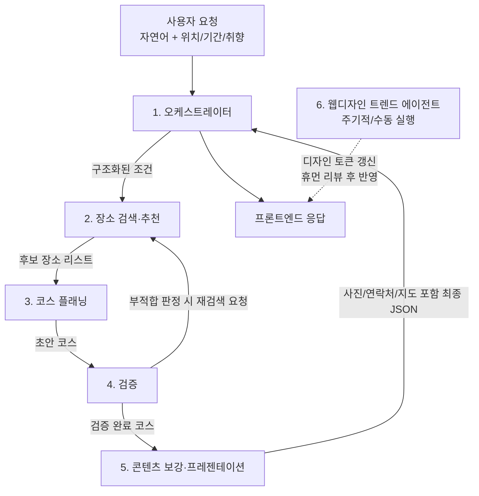

# 양평군 AI 여행 코스 추천 서비스 — 에이전트 아키텍처 개요

이 디렉토리는 양평군 맛집·카페·관광명소·숙소를 아우르는 AI 여행 코스
추천 서비스를 위한 **에이전트 아키텍처 설계 문서**를 담고 있다.

## 왜 5개인가

장소 "종류"(맛집/카페/관광지/숙소)가 아니라 "처리 단계(역할)"를 기준으로
에이전트를 나눈다. 종류별로 에이전트를 만들면 4개+α가 되지만, 실제로는
모두 동일한 검색 로직에 카테고리 파라미터만 다를 뿐이라 하나의 에이전트
(장소 검색·추천 에이전트)가 담당한다.

지도 렌더링, 실시간 위치, 사진 표시, 연락처 노출은 **에이전트가 아니라
프론트엔드/Tool(외부 API 연동)**이 처리한다. 이런 것까지 에이전트로
쪼개는 것은 과설계다.

## 에이전트 구성 (런타임 5개 + 디자인 리서치 1개, MVP는 3개로 축소 가능)

두 개의 서로 다른 트랙으로 나뉜다.

**A. 서비스 런타임 파이프라인** — 사용자 요청마다 실시간으로 호출됨

| # | 파일 | 역할 |
|---|------|------|
| 1 | [01-orchestrator-agent.md](./01-orchestrator-agent.md) | 사용자 요청 해석 + 전체 워크플로우 총괄 |
| 2 | [02-place-retrieval-agent.md](./02-place-retrieval-agent.md) | 카테고리별(맛집/카페/관광지/숙소) 후보 장소 검색 |
| 3 | [03-itinerary-composer-agent.md](./03-itinerary-composer-agent.md) | 동선·시간대 고려한 코스(Day1/Day2…) 구성 |
| 4 | [04-validation-agent.md](./04-validation-agent.md) | 영업시간·휴무일·실시간 혼잡도 등 현실성 검증 |
| 5 | [05-enrichment-presentation-agent.md](./05-enrichment-presentation-agent.md) | 사진·연락처·지도링크 보강 + 최종 응답 포맷 |

**B. 개발/운영 지원 트랙** — 사용자 요청과 무관하게 주기적으로 실행됨

| # | 파일 | 역할 |
|---|------|------|
| 6 | [06-web-design-trend-agent.md](./06-web-design-trend-agent.md) | 최신 UI/UX 트렌드 조사 → 디자인 토큰(컬러/타이포/레이아웃) 갱신 |

## 데이터 흐름



> 6번은 1~5번과 데이터를 주고받지 않는 별도 트랙이다 (점선 표시).
> 사용자 요청 경로가 아니라 분기별 리서치로 디자인 기준만 갱신한다.

## 실시간 흐름 예시 (트레이싱)

> 사용자: "이번 주말 1박2일, 커플 여행, 감성 카페 위주, 차 없이 대중교통
> 이용, 두물머리 근처에서 시작하고 싶어요."

1. **오케스트레이터**가 자연어를 구조화:
   ```json
   {
     "duration_days": 2,
     "party": "couple",
     "preferences": ["cafe_aesthetic"],
     "transport": "public_transit",
     "start_location": "두물머리"
   }
   ```
2. **장소 검색·추천 에이전트**가 네이버 검색 API(지역 검색)로 두물머리
   인근 카페 10곳, 맛집 8곳, 관광지 6곳, 숙소 5곳을 검색 → 취향(감성
   카페)에 맞게 카페 후보를 상위로 재정렬.
3. **코스 플래닝 에이전트**가 대중교통 이동시간을 고려해 Day1(오후 도착 →
   카페 → 저녁 맛집 → 숙소), Day2(아침 관광지 → 점심 맛집 → 귀가)로 배치.
4. **검증 에이전트**가 Day1 카페의 정기휴무일이 토요일임을 확인하고
   장소 검색 에이전트에 대체 카페 재요청.
5. **콘텐츠 보강 에이전트**가 최종 코스에 각 장소의 사진 3장, 전화번호,
   네이버맵 링크, 좌표를 붙여 프론트엔드 응답 스키마로 반환.

## MVP 축소판 (빠른 검증용)

- **A. 요청 해석 + 장소 검색** (1+2 통합)
- **B. 코스 구성 + 검증** (3+4 통합, 검증은 룰 기반 함수로 단순화)
- **C. 응답 포맷팅** (5, LLM 없이 일반 백엔드 로직으로 대체 가능)

→ 실질적으로 LLM 에이전트는 A, B 2개면 MVP 시작 가능.

## 데이터 소스 권장안

| 소스 | 용도 | 비고 |
|------|------|------|
| 네이버 검색 API (지역 검색) | 장소 검색, 상호명/주소/전화번호, 인기도 신호 | 1순위. 좌표는 TM128(KATEC)로 반환되어 WGS84 변환 필요 |
| 네이버 지도/Directions API (Naver Cloud Platform) | 지도 렌더링, 자동차 경로/소요시간 | 유료(NCP 콘솔 별도 관리), 지도·길찾기 담당 |
| 한국관광공사 TourAPI (공공데이터포털) | 관광지/숙소 상세정보, 사진, 소개글 | 네이버 API 보강용으로 병행 |
| 카카오 로그인 | 사용자 인증(로그인)만 담당 | 장소/지도 용도로는 사용하지 않음 — 로그인 전용 |
| 자체 캐시 DB | 위 소스를 적재해 우선 조회 | API 호출 비용/지연 절감 |

## 구현 방식

- 프레임워크(LangGraph 등) 없이 **Claude/GPT API 직접 호출 + 백엔드
  자체 오케스트레이션**(함수/서비스 호출 체인)으로 구현.
- 각 에이전트는 "하나의 System Prompt + 정해진 Tool 목록"으로 구현된
  독립적인 LLM 호출 단위이며, 오케스트레이터가 순서대로/조건부로 호출한다.
